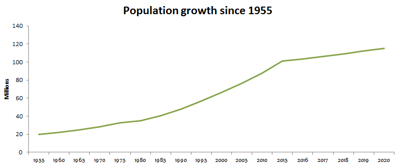

[About us](Aboutus.md)
# Road to entering first world, an alternative approach.

The realities of today’s world, much similar to previous times, indicate exciting opportunities that lay ahead as well as mountainous challenges that require courage, innovation and new strategies to overcome. The purpose of this piece is to first acknowledge the clear warning signs that exist today followed by a brief explanation on an alternate approach to a sustainable solution. 
* Hunger: The [2019 Global Hunger Index] has the country 97th out of the 117 ranked countries. It is estimated[around 22.5M ](https://www.macrotrends.net/countries/ETH/ethiopia/hunger-statistics) of the population lives 'below minimum level of dietary energy consumption.
* Clean water:
* Access to energy: 

